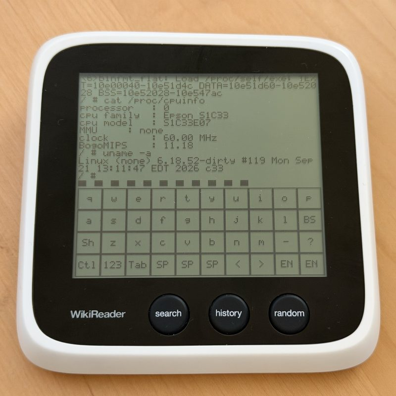
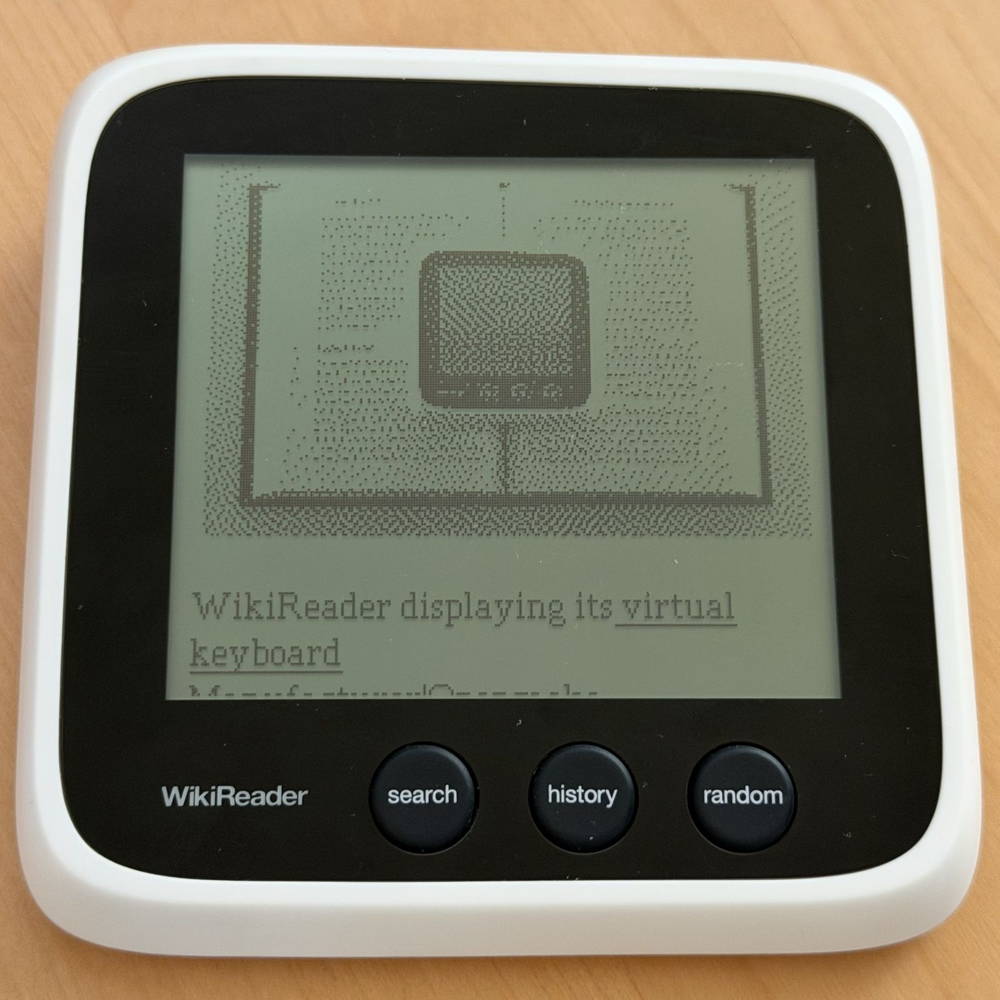
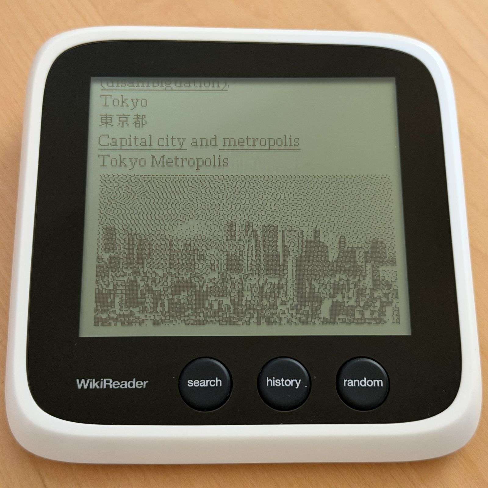
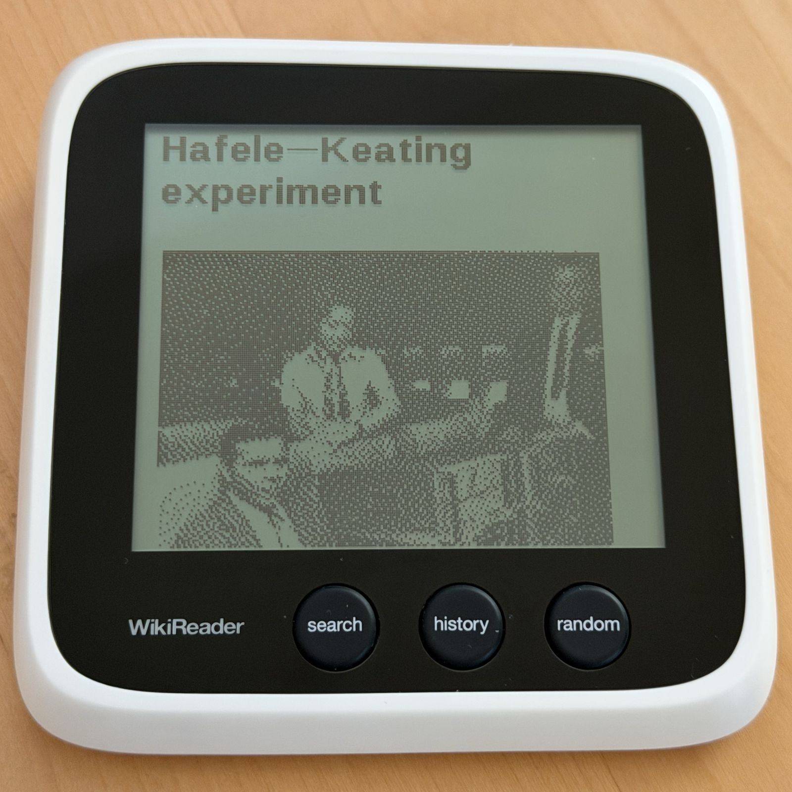

# WikiReader









Firmware and tools for the Epson S1C33 WikiReader handheld. Forked from
[stephen-mw/wikireader](https://github.com/stephen-mw/wikireader).

Most of the work here is a current toolchain, a full-system emulator, a reader
for standard ZIM archives, and the operating systems and emulators that run on
the device. The original dump-processing pipeline still works and is
unchanged.

## What's here

- `host-tools/toolchain-c33` - binutils 2.47 and GCC 16.2 targeting C33,
  prefix `c33-epson-elf-`. Builds the complete firmware. The original
  binutils 2.10.1 / GCC 3.3.2 build is kept as an ABI and assembler oracle.
- `emulator` - `wremu`, a full-system emulator. Boots the serial-FLASH chain
  and SD-card applications, including the DMA kernel. Runs headless or in an
  SDL2 window. Timing is modelled and calibrated against hardware; the limits
  are documented.
- `zim` - `zim.app`, a reader for ZIM 6 archives, the format Kiwix uses. Reads
  them through the kernel's FatFs service. Zstandard and WebP decoders are
  included, since the C33 has to decode both itself. Boot files sit on FAT32
  and the archive on a second exFAT partition, so archives over 4 GiB work.
- `samo-lib` - the grifo kernel, FatFs R0.16, mini-libc and drivers. SD reads
  use 32-bit DMA.
- `wiki` - the original reader application, with fixes.
- `doom` - `doom.app`. Monochrome, touch movement, front-button controls.
  Engine source is vendored and pinned.
- `minivmac` - `minivmac.app`, a soundless 4 MiB Macintosh Plus that boots
  System 7.1 to the Finder. A 68000-to-C33 trace translator runs the hot paths
  and falls back to Mini vMac's own handlers. The 512x342 screen is shown
  through a native-resolution 240x160 viewport that pans at the edges, and
  touch drives the mouse. ROM and floppy images are user-supplied. Upstream
  Mini vMac is fetched at a pinned revision on the first build.
- `nuttx` - `nuttx.app`, Apache NuttX on the C33: NSH with 139 Toybox
  commands (`awk grep sed find sort xargs tar` ...), `vi`, a hex editor, ZMODEM
  transfer, four interpreters (Lua, MicroPython, BASIC and the WikiReader's
  own Forth) and a native TinyCC that compiles C33 code on the device, itself
  included. It drives the card with its own SPI and MMC/SD drivers and mounts
  the boot partition at `/sd`; the exFAT archive partition needs a driver it
  does not have. It runs from the launcher like the other applications, but
  takes the machine over from the kernel rather than calling it, and keeps it
  until `poweroff` or `reboot`. The port is carried as an overlay and patches
  against pinned upstream revisions, which the first build fetches.
- `linux` - a no-MMU Linux 6.18 running natively on the C33, entered from the
  same FLASH and file-loader chain as the firmware. It brings up 32 MiB of
  SDRAM, generic IRQs, a 100 Hz tick, both UARTs on serial-core, and SPI with
  MMC/SD and HSDMA reads, mounting the card's FAT partition. The panel is
  `/dev/fb0` and the touchscreen `/dev/input/event0`, bound through serdev.
  Userspace is static BusyBox 1.38 as PID 1, bFLT binaries linked against
  uClibc-ng, a framebuffer terminal and soft keyboard on a PTY, and a recovery
  shell on the serial port. The kernel builds in a Debian VM, not on macOS.
- `riscv` - `riscv.app`, an rv32ima machine: an interpreter, and a translator
  that emits native C33 code instead. It boots a no-MMU M-mode Linux with a
  terminal and soft keyboard on the panel, and carries a bare-metal benchmark
  image that attributes cost per guest kernel. The guest kernel and device
  trees are fetched, not built here.
- `llama` - `llama.app`, Llama 2 inference. `stories260K` generates at 119 ms
  a token with int8 weights and no floating point anywhere in the forward
  pass. Checkpoints come from `tinyllamas` and are converted on the host.
- `sparrow` - an offline factual answer engine over Wikidata claims. It works,
  but has only been measured against a sample; see `sparrow/STATUS.md`.

Each directory has its own README with the detail.

## Building

Build the toolchain first. It downloads and builds binutils and GCC, and takes
about ten minutes:

```sh
host-tools/toolchain-c33/binutils/build.sh host-tools/toolchain-c33/work
host-tools/toolchain-c33/gcc/rebuild.sh
```

It installs under `host-tools/toolchain-c33/work/install/`, which is what
everything else looks for by default. Then, from the repository root:

```sh
make wiki zim doom
```

That builds all three applications; mini-libc, drivers, fatfs and grifo come in
as dependencies.

`make minivmac` builds the Macintosh emulator separately. Its first build
fetches the pinned upstream source. See `minivmac/README.md` for the required
card layout and ROM/disk names.

`make nuttx` builds `nuttx.app` as well. It is separate because it does not
build from this tree: the first run clones NuttX, nuttx-apps and TinyCC at
pinned revisions, about 340 MB, and lays this repository's port over them. It
also needs GNU `make` and `flock`. See `nuttx/README.md`.

`make -C riscv` and `make -C llama` build `riscv.app` and `llama.app` with the
same toolchain. `riscv/fetch-linux.sh` fetches the guest kernel and device
trees the RISC-V Linux entry needs.

Native Linux builds in an ARM64 Debian Lima VM, because Kbuild and the C33
toolchain want a Linux userspace:

```sh
make -C linux provision    # once: the VM and its build prerequisites
make -C linux toolchain    # once: a Linux-hosted C33 toolchain
make -C linux build
```

`make -C linux boot-test` then boots the result through the full emulated
path and checks the console, the card, the panel and the touch input. See
`linux/README.md`.

Clean targets are `<component>-clean`. Extra flags go in `OPT`, which is
appended after `-Werror` and already defaults to `-O2`. Build output is
git-ignored.

The original EPSON binutils 2.10.1 / GCC 3.3.2 toolchain is still buildable
with `make toolchain`. Nothing depends on it; it is kept as an ABI and
assembler oracle. Set `TOOLCHAIN_BIN` to `host-tools/toolchain-install/bin` to
build with it.

## Emulator

```sh
make -C emulator
make -C emulator check
```

The decode tables are committed, so building the emulator does not need the
cross-compiler. SDL2 is only needed for the window (`brew install sdl2`).
`check` runs on a bare checkout; the few tests that need a local card image or
objdump captures say so and skip.

Running firmware needs two things the repository does not carry: a kernel you
have built, and a card image. `emulator/README.md` covers both, along with the
boot chain and the profiling caveats. Once you have them:

```sh
cd emulator
./wremu -c images/wrcard.img images/grifo.elf
```

`-R` resets and runs headless, `-n` caps cycles, `-s` traces syscalls, and
`-K`/`-T`/`-N` script keys, taps and buttons.

## SD cards

`zim/make-card-image` (macOS) writes a two-partition card: FAT32 for the boot
files, exFAT for the archive. `zim/README.md` has the layout and the launcher.
Pass `--nuttx` to add `nuttx.app` to the menu.

`install-card.sh` updates a card already made: with the boot partition
mounted, it copies the built applications and icons over, rewrites their
launcher entries in `init.ini` in place, and verifies every file again after
a remount.

## Classic image build

The original pipeline renders a Wikimedia dump into the WikiReader's own
format. It runs in Docker:

```sh
docker pull stephenmw/wikireader
docker run --rm -v $(pwd)/build:/build -ti \
    docker.io/stephenmw/wikireader:latest autowiki 20200601
```

The result is in `build/<date>/image`; copy it to a FAT32 card. It needs about
16 GB of RAM and runs a little over 12 hours. The manual steps, the
dump-cleaning one-liner and multi-machine builds are in
[doc/image-build.text](doc/image-build.text).

This is separate from `zim.app`, which reads ZIM archives directly and needs
none of it.

## Notes

The Epson S1C33 manuals are not in this repository. They are available from
Epson and the Internet Archive; `host-tools/toolchain-c33/gcc/ABI.md` says
which ones and what they cover.

The older notes under `doc/` describe the legacy 3.3.2 path, including a
32-bit-host workaround the current toolchain does not need.
